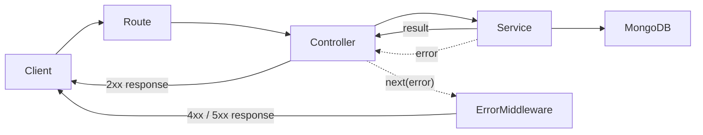
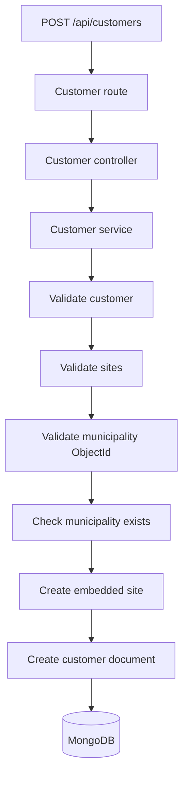

# Maintenance Tracker

A backend-focused maintenance management application built with **Node.js, Express, TypeScript and MongoDB**.

The project is being developed incrementally as a practical environment for improving backend development skills, API design, MongoDB data modelling, TypeScript and application architecture.

The long-term goal is to model a real maintenance workflow where customers can have multiple sites, sites can contain serviced equipment, and maintenance activities can be planned and tracked.

> **Status:** Work in progress.
> The current focus is on backend architecture, API design and data modelling. A frontend will be added later.

---

## Why I started with municipalities

The first domain implemented in the project was **municipalities**.

Municipality information is intended to be reused by several future parts of the application:

* customer sites
* service locations
* technician planning
* equipment locations
* geographic and distance-based queries

Instead of storing municipality names repeatedly as plain text, the application keeps a canonical municipality collection and other entities reference those records.

Municipalities were also a useful starting point for practising several backend and MongoDB concepts on a real dataset:

* importing external structured data
* cleaning and normalising data
* removing duplicate records
* MongoDB bulk writes
* indexes
* prefix search
* query performance analysis
* references between collections

The municipality dataset is imported from an official German municipality Excel dataset using a dedicated import script.

---

## Municipality search

Municipality names have a separate normalised `searchName` field.

For example:

```text
München
↓
munchen
```

The API normalises the incoming search query in the same way.

This allows searches such as:

```text
Mün
MUN
mun
```

to operate on the same indexed field while keeping the original municipality name unchanged.

The search endpoint also:

* requires at least 3 characters
* limits returned results
* escapes regular expression characters
* uses prefix matching

Example:

```http
GET /api/municipalities?search=mun&limit=20
```

### Search optimisation

The first implementation used a case-insensitive regular expression search.

Although it was fast on a small local dataset, MongoDB `explain()` showed that the query required scanning a large part of the collection.

Adding an index alone did not solve the problem because the case-insensitive regular expression still caused a large index scan.

The search was therefore changed to use:

```text
normalised search field
+
prefix query
+
index
```

This significantly reduced the number of examined index keys and provided a more scalable search strategy.

---

# Current domain model

Customers can contain multiple sites.

A site belongs directly to a customer, so sites are currently **embedded inside the customer document**.

Municipalities, on the other hand, are shared canonical data and are therefore **referenced using ObjectId**.

```text
Customer
│
├── name
├── createdAt
├── updatedAt
│
└── sites[]
     │
     ├── _id
     ├── name
     ├── address
     ├── municipalityId ──────────┐
     ├── createdAt                │
     └── updatedAt                │
                                  ▼
                           Municipality
                           ├── _id
                           ├── officialKey
                           ├── name
                           ├── searchName
                           ├── postalCode
                           └── location
```

Each site has its own timestamps because a customer may open a new location, acquire another building, or start using serviced equipment at an existing location later.

---

## Why embed sites but reference municipalities?

This was an intentional modelling decision.

### Sites are embedded

Sites usually:

* belong to exactly one customer
* are commonly loaded together with the customer
* are part of the customer's lifecycle

Embedding therefore makes retrieving a customer and its sites straightforward.

### Municipalities are referenced

Municipalities:

* are shared by many customer sites
* represent canonical external data
* should not be duplicated inside every customer document

For this reason, customer sites contain:

```ts
municipalityId: ObjectId
```

rather than a duplicated municipality object.

---

# Request flow

The backend is separated into layers with different responsibilities.



### Routes

Routes define the available API endpoints and connect HTTP methods to controllers.

Examples:

```text
POST /api/customers
GET  /api/customers
GET  /api/municipalities
```

### Controllers

Controllers handle the HTTP layer:

* requests
* responses
* HTTP status codes
* forwarding errors

They intentionally contain very little business logic.

### Services

Services contain application and domain logic:

* validation
* preparing customer sites
* validating municipality references
* MongoDB operations
* aggregation queries

### Middleware

Shared middleware handles behaviour that applies across multiple endpoints.

The current example is centralised error handling.

Future middleware may include:

* authentication
* request logging
* authorisation
* rate limiting

---

# Customer creation flow

Creating a customer currently follows this flow:



Example request:

```json
{
  "name": "Example GmbH",
  "sites": [
    {
      "name": "Main Plant",
      "address": "Industriestraße 12",
      "municipalityId": "MUNICIPALITY_OBJECT_ID"
    }
  ]
}
```

The API verifies that the supplied municipality ID is valid and that the referenced municipality actually exists before saving the customer.

---

# Loading customers

Municipality information is stored separately but is useful when returning customers to the client.

The customer query therefore uses a MongoDB aggregation pipeline.

Simplified flow:

```text
customers
    ↓
$unwind sites
    ↓
$lookup municipalities
    ↓
attach municipality to site
    ↓
$group sites back into customer
    ↓
API response
```

The aggregation currently uses MongoDB stages including:

```text
$unwind
$lookup
$set
$unset
$group
```

This lets the database keep municipality data normalised while still returning convenient enriched customer objects through the API.

---

# Error handling

Expected application errors and unexpected server errors are handled separately.

Examples of expected client errors include:

```text
Invalid municipality ID
Municipality does not exist
Invalid site data
Customer name is required
```

These can return an appropriate `4xx` response.

Unexpected failures such as database or infrastructure errors are handled by central error middleware and return a generic:

```text
500 Internal Server Error
```

without exposing implementation details to the client.

---

# Project structure

```text
src/
├── config/
│   └── database.ts
│
├── controllers/
│   ├── customers.controller.ts
│   └── municipalities.controller.ts
│
├── errors/
│   └── AppError.ts
│
├── middleware/
│   └── error.middleware.ts
│
├── routes/
│   ├── customers.routes.ts
│   └── municipalities.routes.ts
│
├── services/
│   └── customers.service.ts
│
├── types/
│   └── customer.ts
│
├── app.ts
└── server.ts

scripts/
└── importMunicipalities.js
```

The separation is intentionally kept relatively small.

Additional architectural layers will only be introduced when the application complexity makes them useful.

For example, a repository/data-access layer could be introduced later if database queries start dominating the service layer.

---

# Technology

## Backend

* Node.js
* Express
* TypeScript
* MongoDB native driver
* REST API

## Data processing

* ExcelJS
* MongoDB bulk operations

## Development

* tsx
* TypeScript strict mode
* Postman for API testing
* MongoDB Compass for database inspection and query analysis

---

# Current functionality

Implemented so far:

* MongoDB connection and application bootstrap
* municipality dataset import
* municipality deduplication
* municipality name normalisation
* indexed municipality prefix search
* search query validation and result limits
* customer creation
* embedded customer sites
* municipality references using `ObjectId`
* municipality reference validation
* customer retrieval
* MongoDB aggregation with municipality lookup
* TypeScript domain and API input types
* runtime validation using TypeScript type guards
* route / controller / service separation
* centralised API error handling

---

# Planned development

The project will continue incrementally.

## API and domain

Planned next steps include:

* customer retrieval by ID
* adding new sites to an existing customer
* updating customers and sites
* equipment / machine entities
* maintenance records
* maintenance status and history
* filtering and pagination
* technician-related functionality
* geographic and distance-based queries

## Quality

* automated API tests
* unit tests for selected business logic
* improved runtime validation
* API documentation
* logging

## Frontend

A frontend is planned using:

* React
* TypeScript

The frontend will consume the REST API rather than sharing business logic with the backend.

## Microservices and event-driven architecture

The application currently starts as a **modular monolith**.

This is intentional.

At the current size, splitting the application into multiple services would add deployment and communication complexity without providing a clear benefit.

As the project grows, I want to experiment with extracting selected responsibilities into separate services where a real domain boundary exists.

Possible candidates could include:

```text
Maintenance API
      │
      ├── Customer / Equipment domain
      │
      ├── Maintenance domain
      │
      └── Events
             ↓
        Message broker
          /       \
         /         \
        ▼           ▼
Notification    Audit / History
Service         Service
```

Possible events could include:

```text
MAINTENANCE_CREATED
MAINTENANCE_SCHEDULED
MAINTENANCE_COMPLETED
EQUIPMENT_ADDED
```

This would provide an opportunity to explore:

* microservice boundaries
* asynchronous communication
* event-driven architecture
* message brokers such as Kafka
* service ownership of data
* eventual consistency
* failure handling between services

The goal is **not to split the application into microservices only for the sake of using microservices**.

A service would only be extracted when there is a clear responsibility, independent lifecycle or communication requirement that justifies the additional complexity.

---

# Running the project

Install dependencies:

```bash
npm install
```

Create a `.env` file:

```env
MONGODB_URI=mongodb://localhost:27017
```

Start the development server:

```bash
npm run dev
```

Run the TypeScript check:

```bash
npm run typecheck
```

The API runs by default on:

```text
http://localhost:3000
```

---

# Development approach

This project is intentionally developed in small iterations.

The goal is not only to add features, but also to understand the decisions behind them:

* data modelling
* database queries
* query performance
* validation
* error handling
* separation of responsibilities
* API design
* application architecture

Where possible, changes are measured and verified instead of introducing patterns or technologies only because they are commonly used.

The architecture is expected to evolve together with the requirements of the application.
